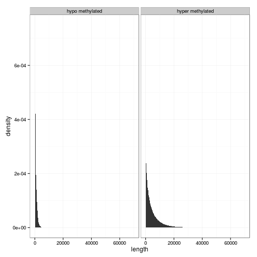
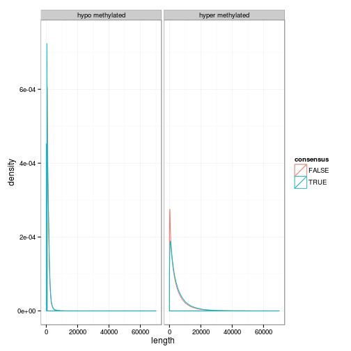

# Introduction
The aim of this analysis is to annotate eQTL obtained from the analysis
of neutrophils with the results of bisulfite sequencing and ChIP-seq
for several histone modifications generated by the Blueprint consortium.
BED files with ChIP-seq peaks and hyper- and hypo-methylated regions
all neutrophil samples were obtained form the Blueprint ftp server.

All eQTL significant at an FDR threshold of 0.05 will be annotated with
the distance to the closest hyper/hypo methylated site as well as the distance
to the available histone marks. The subsequent analysis of these distances
focuses on eQTL of particular interest, e.g. the lead SNP for each gene or
all peak eQTL.


To be able to assess the significance of the proximity between eSNPs and
features of interest we also generate the corresponding background distributions
by considering the distance between the features and all tested SNPs.


# Methylation data
## Data processing
The BED files provided by Blueprint do not conform to the BED specification.
This causes difficulties when trying to process them with BED file parsers.
To remedy this the first five columns of each file are extracted prior
to further analysis.


The re-formatted BED files are imported into R for further processing with 
Bioconductor. 


## Defining regions of hyper- and hypo-methylation
Regions considered to be either hyper- or hypo-methylated are defined as follows.
A genomic region is considered to be hyper-methylated in neutrophils if it
meets the criteria for hyper-methylation used in the analysis of the Blueprint consortium
(average methylation of >0.75 and all CpGs in the regions have methylation >0.5)
in at least two neutrophil samplesand the region isn't hypo-methylated in any of 
the neutrophil samples. Hypo-methylated regions are defined accordingly.


 

Considering the length distribution of hyper- and hypo-methylated regions it is apparent
that a lot of regions are quite short while some, especially for hyper-methylation,
are quite large. This is further emphasised by the following summary table.


|    &nbsp;     |  hypo methylated  |  hyper methylated  |
|:-------------:|:-----------------:|:------------------:|
|   **Min.**    |         2         |         1          |
|  **1st Qu.**  |        54         |        894         |
|  **Median**   |        157        |        2720        |
|   **Mean**    |        456        |        4770        |
|  **3rd Qu.**  |        529        |        6370        |
|   **Max.**    |       24700       |       130000       |

Table: Summary of length distribution for hypo- and hyper-methylated regions.

Based on this we set the minimum overlap between regions from different individuals
to 50bp. 

```
## Warning: Removed 252 rows containing non-finite values (stat_density).
## Warning: Removed 45 rows containing non-finite values (stat_density).
```

 

While this excludes small regions the effect on the length of the remaining regions is limited,
consistent with substantial overlaps between samples. A total of 
39892 hypo- and
422555 hyper-methylated
regions remain after filtering. 


|    &nbsp;     |  hypo methylated  |  hyper methylated  |
|:-------------:|:-----------------:|:------------------:|
|   **Min.**    |        50         |         50         |
|  **1st Qu.**  |        250        |        1320        |
|  **Median**   |        618        |        3360        |
|   **Mean**    |        935        |        5470        |
|  **3rd Qu.**  |       1310        |        7300        |
|   **Max.**    |       22200       |       115000       |

Table: Summary of length distribution for hypo- and hyper-methylated consensus regions.

## Annotating eQTL
All significant eQTL are annotated with their distance to the closest hyper- and 
hypo-methylated regions.


Considering the most significant SNP for each gene, in addition to the
overal distribution of distances to the closest methylation island the
number of SNPs within islands, i.e. those with distance 0, are of
particular interest.

 


```
## Warning: Chi-squared approximation may be incorrect
```
The proportion of cis eSNPs located in hypo-methylated regions
(3.7366%) is substantially
higher than would be expected by chance 
(only 0.8285% 
of imputed SNPs are located in hypo-methylated regions). The significance 
of this difference is confirmed via a formal test for the equality of these
proportions.


|  Test statistic  |  df  |      P value       |  Alternative hypothesis  |
|:----------------:|:----:|:------------------:|:------------------------:|
|      482.5       |  1   | _6.093e-107_ * * * |        two.sided         |

Table: 2-sample test for equality of proportions with continuity correction: 6933 and 181 out of 836800 and 4844 respectively.
  
For the much more common hyper-methylated sites the difference between eSNPs and
background is less pronounced. Overall 
42.7591% of imputed SNPs
fall within a hyper-methylated region while only 
38.5632% are located within one.


|  Test statistic  |  df  |      P value      |  Alternative hypothesis  |
|:----------------:|:----:|:-----------------:|:------------------------:|
|      34.48       |  1   | _4.314e-09_ * * * |        two.sided         |

Table: 2-sample test for equality of proportions with continuity correction: 357808 and 1868 out of 836800 and 4844 respectively.
 

 


# Appendix {-}
## Session Info

```
## R version 3.0.1 (2013-05-16)
## Platform: x86_64-unknown-linux-gnu (64-bit)
## 
## locale:
##  [1] LC_CTYPE=en_GB.UTF-8    LC_NUMERIC=C           
##  [3] LC_TIME=en_GB           LC_COLLATE=en_GB.UTF-8 
##  [5] LC_MONETARY=en_GB       LC_MESSAGES=en_GB.UTF-8
##  [7] LC_PAPER=C              LC_NAME=C              
##  [9] LC_ADDRESS=C            LC_TELEPHONE=C         
## [11] LC_MEASUREMENT=en_GB    LC_IDENTIFICATION=C    
## 
## attached base packages:
## [1] parallel  methods   stats     graphics  grDevices utils     datasets 
## [8] base     
## 
## other attached packages:
## [1] pander_0.3.8         scales_0.2.3         ggplot2_0.9.3.1     
## [4] GenomicRanges_1.12.5 IRanges_1.18.4       BiocGenerics_0.6.0  
## [7] knitr_1.6           
## 
## loaded via a namespace (and not attached):
##  [1] codetools_0.2-8    colorspace_1.2-2   dichromat_2.0-0   
##  [4] digest_0.6.3       evaluate_0.5.5     formatR_1.0       
##  [7] grid_3.0.1         gtable_0.1.2       labeling_0.1      
## [10] MASS_7.3-26        munsell_0.4        plyr_1.8          
## [13] proto_0.3-10       RColorBrewer_1.0-5 reshape2_1.2.2    
## [16] stats4_3.0.1       stringr_0.6.2      tools_3.0.1
```
