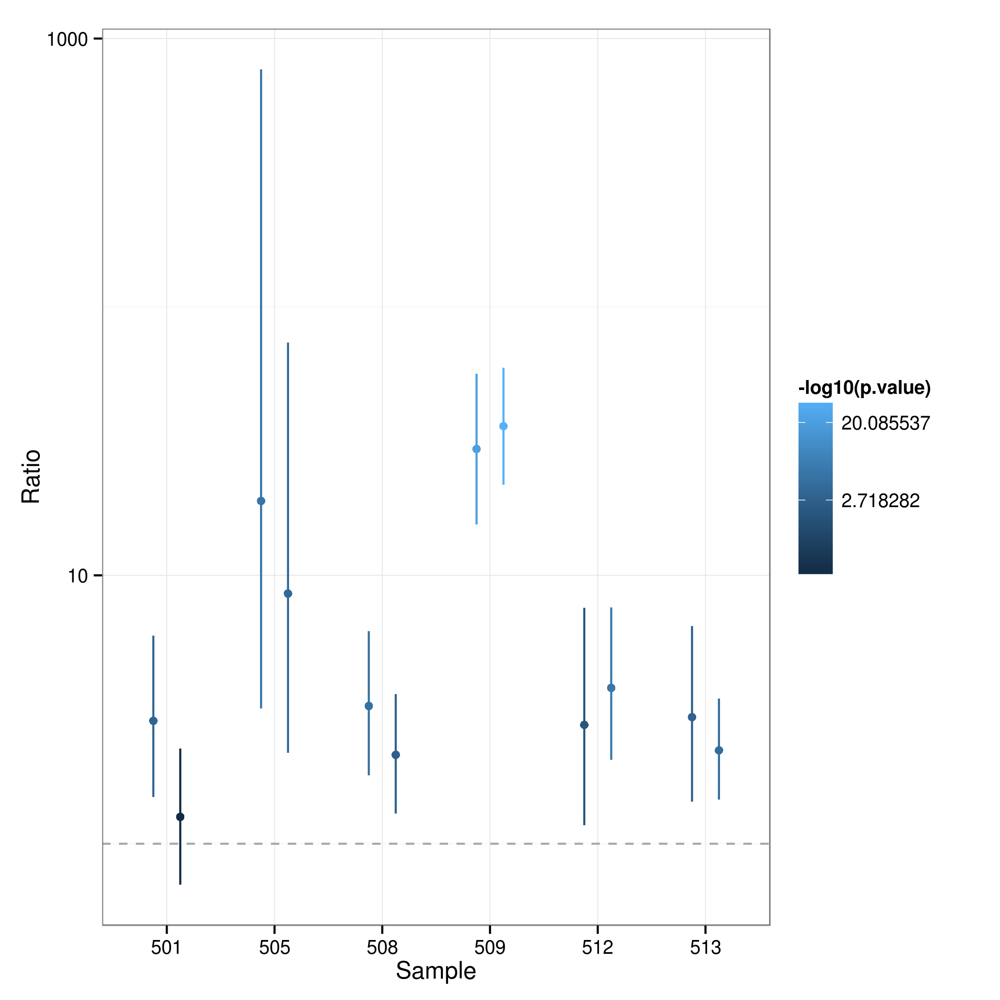
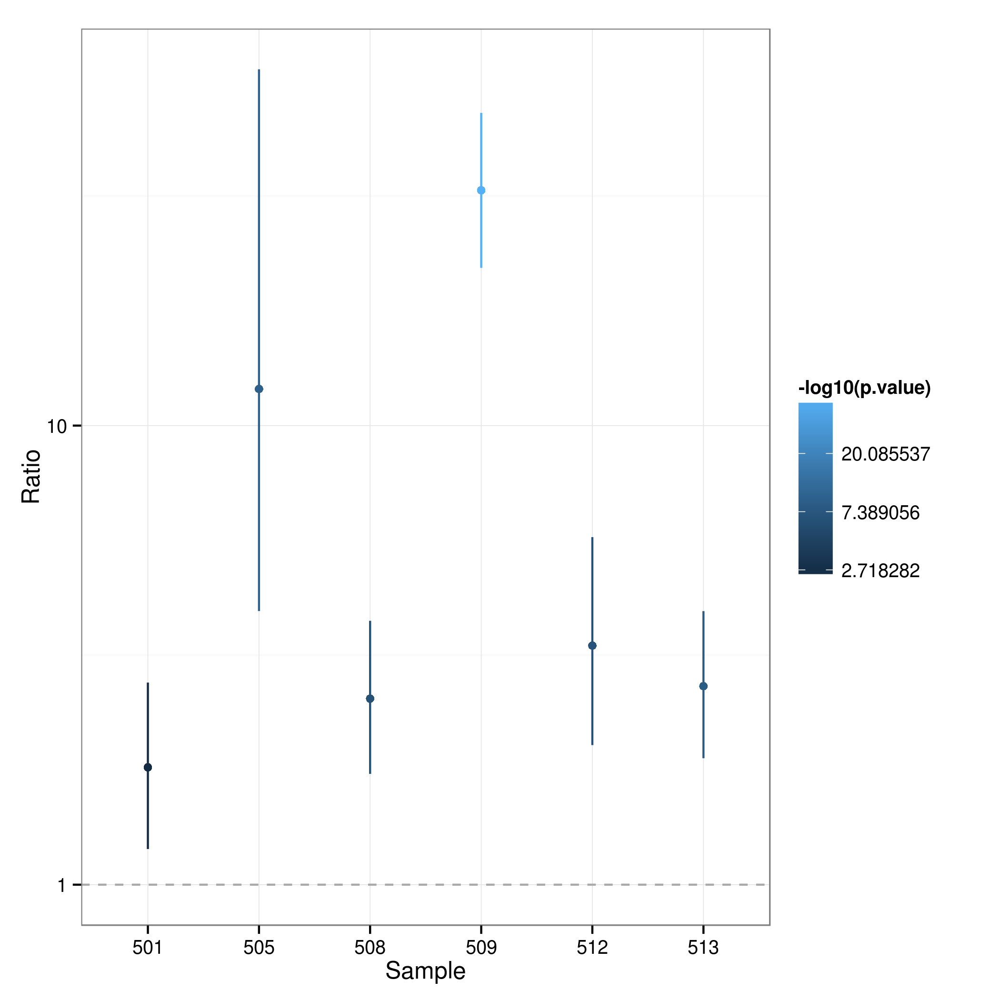

# Introduction


This is an analysis of ChIP ddPCR data to test whether there is allele specific binding 
to a region of the NOD2 gene. Two technical replicates of ChIP and input were generated
for 6 samples. Measurements for the two 
alleles (_chip_ and _input_) were taken from the same well, i.e. for each
replicate the two alleles are paired.

# Testing for allele specific binding
The number of copies of each allele contained in a droplet used for ddPCR measurements 
are assumed to come from a Poisson distribution and concentration estimates are based on this. 
The concentration estimates essentially are estimates of Poisson means that have been scaled 
to correspond to the same unit volume ($1\\mu$L). At low concentrations the number
of positive droplets is essentially the same as the number of copies of the target
sequence sampled because the probability that more than one copy is contained in a
single droplet is very small. In this case the droplet counts provided in the data file
provide a good estimate of the corresponding Poisson rate. This should be the case for
most ChIP samples. However, the concentration of input samples tends to be higher and this
assumption may no longer be reasonable. We therefore use the provided concentration
estimates for the input samples^[Note that these are larger than the estimates obtained from
droplet counts by a factor of approx. 1000.] to obtain baseline estimates of the expected
allele ratio in the absence of allele specific binding. The allele specific Poisson rates 
estimated from the observed droplet counts for the ChIP samples are then compared 
against this baseline to establish whether there is evidence of allele specific binding.  


|  Sample  |  Type  |  C 1  |  T 1  |  C 2  |  T 2  |  Ratio 1  |  Ratio 2  |
|:--------:|:------:|:-----:|:-----:|:-----:|:-----:|:---------:|:---------:|
|   501    |  chip  | 4.09  | 1.09  | 2.54  | 2.35  |   3.75    |   1.08    |
|   501    | input  | 16.2  | 12.4  | 10.8  | 12.6  |   1.31    |   0.86    |
|   505    |  chip  | 3.98  | 0.11  | 3.35  | 0.21  |   36.18   |   15.95   |
|   505    | input  |  3.4  | 1.74  | 3.03  | 1.62  |   1.95    |   1.87    |
|   508    |  chip  | 3.51  |  1.3  | 3.58  | 2.24  |    2.7    |    1.6    |
|   508    | input  | 2.54  | 3.08  | 1.96  | 2.64  |   0.82    |   0.74    |
|   509    |  chip  | 1.61  | 1.69  | 2.61  | 2.69  |   0.95    |   0.97    |
|   509    | input  | 0.92  | 28.5  | 0.77  | 28.5  |   0.03    |   0.03    |
|   512    |  chip  | 2.51  | 0.67  | 5.78  | 1.36  |   3.75    |   4.25    |
|   512    | input  | 10.7  | 7.99  | 9.59  | 8.63  |   1.34    |   1.11    |
|   513    |  chip  | 2.27  | 1.09  | 7.67  |  3.1  |   2.08    |   2.47    |
|   513    | input  | 2.25  |  3.2  | 2.57  | 2.32  |    0.7    |   1.11    |

Table: **Table 1:** Estimated concentrations (in copies per $\mu$L) for C and T alleles in ChIP and input together with the corresponding ratios.

Table 1 provides an overview of concentration estimates and corresponding
ratios for all samples. The results of the testing procedure are summarised in
Figure 1.


 

We now summarise the data for each individual by combining data from both replicates. To
this end droplet counts for ChIP samples from the same individual are added and corresponding
input concentrations are averaged.


|  Sample  |  Type  |   C   |   T   |  Ratio  |
|:--------:|:------:|:-----:|:-----:|:-------:|
|   501    |  chip  | 6.63  | 3.44  |  1.93   |
|   501    | input  |  27   |  25   |  1.08   |
|   505    |  chip  | 7.33  | 0.32  |  22.91  |
|   505    | input  | 6.43  | 3.36  |  1.91   |
|   508    |  chip  | 7.09  | 3.54  |    2    |
|   508    | input  |  4.5  | 5.72  |  0.79   |
|   509    |  chip  | 4.22  | 4.38  |  0.96   |
|   509    | input  | 1.69  |  57   |  0.03   |
|   512    |  chip  | 8.29  | 2.03  |  4.08   |
|   512    | input  | 20.29 | 16.62 |  1.22   |
|   513    |  chip  | 9.94  | 4.19  |  2.37   |
|   513    | input  | 4.82  | 5.52  |  0.87   |

Table: **Table 2:** Estimated concentrations (in copies per $\mu$L) for C and T alleles in ChIP and input together with the corresponding ratios after pooling data from technical replicates.


 

# Appendix {-}
## Options


```r
library(knitr)
library(pander)
library(ggplot2)
library(reshape2)

opts_knit$set(root.dir = "/well/jknight/vivek")
opts_chunk$set(tidy = TRUE)
opts_chunk$set(echo = FALSE)
opts_chunk$set(autodep = TRUE)
opts_chunk$set(dpi = 300)
opts_chunk$set(dev = c("png", "pdf"))
options(figcap.prefix = "Figure", figcap.sep = ":", figcap.prefix.highlight = "**")
options(tabcap.prefix = "Table", tabcap.sep = ":", tabcap.prefix.highlight = "**")
```

## Custom functions


```r
figRef <- local({
    tag <- numeric()
    created <- logical()
    used <- logical()
    function(label, caption, prefix = options("figcap.prefix"), sep = options("figcap.sep"), 
        prefix.highlight = options("figcap.prefix.highlight")) {
        i <- which(names(tag) == label)
        if (length(i) == 0) {
            i <- length(tag) + 1
            tag <<- c(tag, i)
            names(tag)[length(tag)] <<- label
            used <<- c(used, FALSE)
            names(used)[length(used)] <<- label
            created <<- c(created, FALSE)
            names(created)[length(created)] <<- label
        }
        if (!missing(caption)) {
            created[label] <<- TRUE
            paste0(prefix.highlight, prefix, " ", i, sep, prefix.highlight, 
                " ", caption)
        } else {
            used[label] <<- TRUE
            paste(prefix, tag[label])
        }
    }
})

tabRef <- local({
    tag <- numeric()
    created <- logical()
    used <- logical()
    function(label, caption, prefix = options("tabcap.prefix"), sep = options("tabcap.sep"), 
        prefix.highlight = options("tabcap.prefix.highlight")) {
        i <- which(names(tag) == label)
        if (length(i) == 0) {
            i <- length(tag) + 1
            tag <<- c(tag, i)
            names(tag)[length(tag)] <<- label
            used <<- c(used, FALSE)
            names(used)[length(used)] <<- label
            created <<- c(created, FALSE)
            names(created)[length(created)] <<- label
        }
        if (!missing(caption)) {
            created[label] <<- TRUE
            paste0(prefix.highlight, prefix, " ", i, sep, prefix.highlight, 
                " ", caption)
        } else {
            used[label] <<- TRUE
            paste(prefix, tag[label])
        }
    }
})

testRates <- function(n, r, conf.level = 0.95) {
    mult <- if (ncol(n) == 6) 
        2 else 1
    ans <- data.frame(Sample = rep(n$Sample, each = mult))
    if (mult == 2) 
        ans <- cbind(ans, data.frame(Replicate = rep(c(1L, 2L), nrow(n))))
    ans <- cbind(ans, data.frame(Expected = numeric(mult * nrow(n)), Ratio = numeric(mult * 
        nrow(n)), Lower = numeric(mult * nrow(n)), Upper = numeric(mult * nrow(n)), 
        p.value = numeric(mult * nrow(n))))
    for (i in 1:nrow(n)) {
        if (ncol(n) == 6) {
            test <- poisson.test(unlist(n[i, c("C 1", "T 1")]), r = r[["Ratio 1"]][i], 
                conf.level = conf.level)
            ans[2 * i - 1, 3:7] <- c(r[["Ratio 1"]][i], test$estimate, test$conf.int, 
                test$p.value)
            test <- poisson.test(unlist(n[i, c("C 2", "T 2")]), r = r[["Ratio 2"]][i], 
                conf.level = conf.level)
            ans[2 * i, 3:7] <- c(r[["Ratio 2"]][i], test$estimate, test$conf.int, 
                test$p.value)
        } else {
            test <- poisson.test(unlist(n[i, c("C", "T")]), r = r[["Ratio"]][i], 
                conf.level = conf.level)
            ans[i, 2:6] <- c(r[["Ratio"]][i], test$estimate, test$conf.int, 
                test$p.value)
        }
    }
    ans
}
```

## Session info


```
## R version 3.1.1 (2014-07-10)
## Platform: x86_64-pc-linux-gnu (64-bit)
## 
## locale:
##  [1] LC_CTYPE=en_GB.UTF-8       LC_NUMERIC=C              
##  [3] LC_TIME=en_GB.UTF-8        LC_COLLATE=en_GB.UTF-8    
##  [5] LC_MONETARY=en_GB.UTF-8    LC_MESSAGES=en_GB.UTF-8   
##  [7] LC_PAPER=en_GB.UTF-8       LC_NAME=C                 
##  [9] LC_ADDRESS=C               LC_TELEPHONE=C            
## [11] LC_MEASUREMENT=en_GB.UTF-8 LC_IDENTIFICATION=C       
## 
## attached base packages:
## [1] methods   stats     graphics  grDevices utils     datasets  base     
## 
## other attached packages:
## [1] reshape2_1.4  ggplot2_1.0.0 pander_0.5.1  knitr_1.7    
## 
## loaded via a namespace (and not attached):
##  [1] colorspace_1.2-4 digest_0.6.4     evaluate_0.5.5   formatR_1.0     
##  [5] grid_3.1.1       gtable_0.1.2     MASS_7.3-34      munsell_0.4.2   
##  [9] plyr_1.8.1       proto_0.3-10     Rcpp_0.11.2      scales_0.2.4    
## [13] stringr_0.6.2    tools_3.1.1
```
